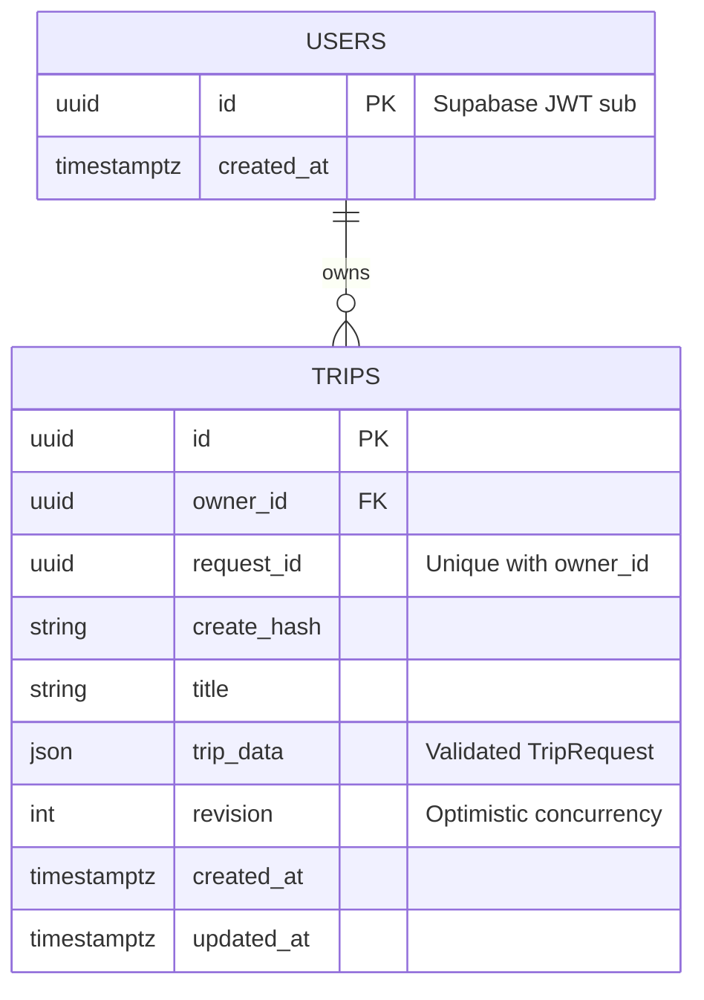

# ADR 0002 — Lưu trip và xác thực người dùng

Ngày: 07/10/2026. Áp dụng cho BASE-03/04/05 và phần users/trips của DB-01. Đây là storage bản nháp, chưa phải itinerary versioning (DB-02/05).

## Kiến trúc

```text
Browser ── email/password ──> Supabase Auth
   │ access token
   ▼
Next.js same-origin proxy ── Bearer ──> FastAPI
                                         │ verify RS256/ES256 + JWKS
                                         │ sub UUID = owner
                                         ▼
                              SQLAlchemy → PostgreSQL (wayo schema)
```

Proxy chỉ chuyển Bearer header và payload cần thiết, không log token, không cache dữ liệu riêng tư. JWT issuer đến từ cấu hình server; bắt buộc exp/iat/sub/iss/aud và role authenticated. Anonymous user và service-role token không được dùng như tài khoản người dùng. Browser chỉ giữ publishable key, backend không cần Supabase service-role secret.

## ERD đã triển khai



Giữ TripRequest dưới dạng JSON ở giai đoạn đầu để lưu đầy đủ timezone/budget/preferences/exclusions/fixed events mà không mất contract. Index phục vụ listing theo owner + updated_at + id. Chưa tối ưu truy vấn theo nội dung trip; sẽ tách cột cần thiết khi có nhu cầu planner/analytics.

User ứng dụng được tạo khi lưu trip đầu tiên; không copy email, mật khẩu hay token. ID user là JWT subject đã xác minh. Chưa triển khai xóa tài khoản hoặc đồng bộ sự kiện auth user bị xóa; đây là phần còn lại trước beta.

## Quy tắc API

- Create yêu cầu `request_id` UUID. Cùng owner + ID + payload trả cùng trip (200 khi replay, 201 khi mới). Reuse ID với payload khác trả 409. Dedup tồn tại trong vòng đời trip; xóa vĩnh viễn xóa cả request marker.
- PUT là thay toàn bộ title + TripRequest, kèm `expected_revision`. Revision tăng bằng câu UPDATE có điều kiện ở DB, tránh mất update khi hai tab cùng lưu.
- DELETE cần expected revision và xác nhận ở UI. Chỉ xóa bản nháp trip; chưa có itinerary/history để cascade.
- Owner luôn lấy từ JWT; client gửi thêm owner_id bị schema từ chối. GET/PUT/DELETE của người khác đều trả 404; list chỉ chứa trip của mình.
- `revision` phục vụ concurrency, **không** là lịch sử snapshot. Chưa có undo/version history cho trip/itinerary.
- Route validate public vẫn không ghi DB; các CRUD routes đều bắt buộc xác thực. Liveness không đại diện cho DB readiness.

## Migration và quyền

Alembic quản lý schema `wayo`; autogenerate chỉ được nhìn schema này để không đề xuất chỉnh/xóa schema Supabase quản lý. RLS bật, không cấp quyền/policy trực tiếp cho browser. Backend chạy bằng table owner; owner filtering trong ứng dụng là bắt buộc ngay cả khi RLS bật. Không tuyên bố RLS tự phân biệt JWT user trong kết nối backend dùng chung.

SQLite chỉ phục vụ test nhanh; PostgreSQL là database chạy ứng dụng. Không tự chuyển sang SQLite khi thiếu hoặc lỗi PostgreSQL. Không có mock identity hoặc auth bypass trong code runtime.

## Còn lại

Profile/taste persistence, destinations/places/evidence, immutable itinerary versions, account deletion, admin authorization, production migration role tách runtime role, staging/live Supabase smoke test. Không đánh dấu toàn bộ DB-01/02 hoặc M0 hoàn thành từ schema users/trips.
